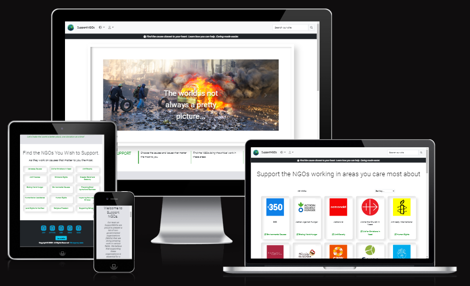

# Hand of Empathy
</br>

**[Link to the deployed site](https://support-ngo.herokuapp.com/)**


# Project Overview
Support NGOs is a platform created during a five day World NGO Day hackathon to help connect people with non-governmental organizations that need support, volunteers, and donations. This project was built using Django, Python, JavaScript and Bootstrap 4, deployed on Heroku and uses Amazon S3 for cloud storage.

*At SupportNGOs, we believe that every contribution, no matter how small, can make a difference. We give you the power to choose your causes and the NGOs you'd like to support.* - [Vasi Pavaloi, Team Emergency Code](https://code-institute-room.slack.com/archives/D04QGJ3ANQH/p1676809115001019)

---
**Table of Contents**
* [Project Overview](#project-overview)
* [User Experience](#user-experience)
    * [Strategy Plane](#strategy-plane)
    * [Scope Plane](#scope-plane)
    * [Structure Plane](#structure-plane)
    * [Skeleton Plane](#skeleton-plane)
    * [Surface Plane](#surface-plane)
* [Agile Methodolody](#agile-methodology)
* [Features](#features)
* [Technologies Used](#technologies-used)
* [Testing](#testing)
* [Deployment](#deployment)
* [Credits](#credits)
* [Acknoledgements](#acknowledgements)

---
## User Experience

### Strategy Plane

### Scope Plane

### Structure Plane

### Skeleton Plane

### Fonts and color

Exo, Roboto, and Montserrat are popular font choices for a variety of design projects due to their versatility and readability.
Exo is a modern sans-serif font that has a clean and futuristic look, making it suitable for technology-based designs.
Roboto, on the other hand, is a more traditional sans-serif font with a humanist touch, giving it a more friendly and approachable feel, making it suitable for both digital and print materials.
Montserrat is a geometric sans-serif font that has a distinctive style with a vintage touch, making it suitable for designs that require a retro or nostalgic feel.

Additionally, all three fonts have a range of weights and styles that allow for flexibility in design, making them suitable for a variety of projects. Whether it's for a website, logo, or printed material, Exo, Roboto, and Montserrat are excellent choices for designers looking for fonts that are modern, versatile, and highly readable.

An earth color scheme is an excellent choice for NGOs, as it communicates the organization's connection to nature and the environment. Using colors such as brown, green, and blue creates a warm and inviting palette that reflects the organization's values and mission.

White, grey, and green are commonly used colors for non-governmental organizations (NGOs) due to their associations with certain values and qualities. White is a symbol of purity, cleanliness, and transparency, which are important values for NGOs that strive for accountability and honesty. NGOs often need to build trust with their stakeholders, including donors and beneficiaries, and white can help convey a sense of openness and sincerity.

Grey is a neutral color that can represent balance, maturity, and reliability. For NGOs that deal with complex social issues, grey can help communicate the seriousness and thoughtfulness of their work. Grey can also convey a sense of stability and longevity, which can be reassuring to stakeholders who want to see long-term solutions to social problems.

Green is a color that is often associated with nature, health, and sustainability. For NGOs that work in environmental conservation, public health, or sustainable development, green can be a powerful symbol of their mission. Green can also represent growth, renewal, and hope, which can be inspiring to stakeholders who want to see positive change in the world.


### Surface Plane

---
## Agile Methodology
### **GitHub Projects**

GitHub Projects was used to manage the development of the site. It helped us break down the larger issues into smaller issues and how these fit into the overall goals of implementing specific features we wanted for the site. We also used labels to distinguish the issues which are part of the setup, of the documentation, the must haves and the enhancements.

* GitHub Projects - in progress

---
## User Stories
|USER STORY |	ISSUE ID |	As a/an |	I want to be able to...	| So that I can...|
| :-------: | :-------: | :-------:| :-----------------------: | :-------------: |
| 1         |    3      |  Site User    |  View home page      | Know more about website|
| 2         |    11     | Site User|  view Navbar      |  view content seamlessly |
| 3         |    6     | Donor  | View catagory of NGO'S | find charity I like to |
| 4         |    14     | Donor | View individual NGO's details | Know more about their work and how I can help them |
| 5         |    29     | Site User |  create new account | access all feature of sign up user|
| 6         |    29     | Site user | sign in  | access  functionality for logged in user|
| 7         |     8     | Site User | write a blog post | encourage others to donate as well |
| 8         |    20     | Site User | like a blog post | show my support for those posts that interest me|


---
## Features

---
## Technologies Used
### **Languages Used**
* [HTML5](https://en.wikipedia.org/wiki/HTML5) was used for the content and structure of the site.
* [CSS3](https://en.wikipedia.org/wiki/CSS#CSS_3) was used for the styling of the site.
* [JavaScript](https://en.wikipedia.org/wiki/JavaScript) was used for the interactivity of the site.
* [Python](https://www.python.org/) was used for the back end programming of the site.
## Frameworks Used
* [DJANGO - v3.2 ](https://docs.djangoproject.com/en/4.1/releases/3.2/) Django is a free and open-source, Python-based web  framework that follows the model–template–views architectural pattern.
* [Bootstrap4 - v4.6](https://getbootstrap.com/docs/4.6/getting-started/introduction/) was used as the frontend framework.
## Databases Used
* [DB.SQLITE3](https://docs.djangoproject.com/en/4.1/ref/databases/#sqlite-notes) was the database used for the project (development).
* [ElephantSQL](https://www.elephantsql.com/) ElephantSQL's Postgres as a Service was used to host the the database for the project (production).
## **Libraries and Packages Used**
* [django-allauth](https://django-allauth.readthedocs.io/en/latest/) is an integrated set of Django applications dealing with account authentication, registration, management, and third-party (social) account authentication.
* [JQuery - v3.5.1](https://jquery.com/) is a fast, small, and feature-rich JavaScript library.
* [Font Awesome Kit](https://fontawesome.com/v5/docs/web/setup/use-kit) is used for its icon toolkit.
* [django-ckeditor v6.5.1](https://django-ckeditor.readthedocs.io/en/latest/) was used to provide a RichTextField p, RichTextUploadingField, CKEditorWidget and CKEditorUploadingWidget
* [django-js-asset v2.0.0](https://pypi.org/project/django-js-asset) This package provides a way of inserting script tags into Django templates that provide extra attributes such as `id` and `data-*` for CSP-compatible data injection.
* [django-summernote==0.8.20.0](https://pypi.org/project/django-summernote/) Summernote is a simple WYSIWYG editor. django-summernote allows you to embed Summernote into Django very handy. Support admin mixins and widgets.
* [django-crispy-forms, v1.14.0](https://pypi.org/project/django-crispy-forms/) was used to build programmatic reusable layouts out of form components.
* [gunicorn](https://gunicorn.org/) - a Python WSGI HTTP Server that allows us to run any Python application concurrently by running multiple processes within a single dyno
* [pillow](https://pypi.org/project/Pillow/) - a required Python imaging library used to enable handling of images.
* [psycopg2](https://pypi.org/project/psycopg2/) - a postgresql database adapter for python and used to connect with our postgres database
* [boto3==1.26.74](https://pypi.org/project/boto3/), [botocore==1.29.74] is an Amazon Web Services (AWS) software development kit (SDK) used to connect to the S3 bucket
* [pip](https://pip.pypa.io/en/stable/) is the package installer for Python, allowing us to install the packages we need for this site.
* [django storages](https://django-storages.readthedocs.io/en/latest/) - collection of custom storage backends for Django

## **Programmes and Applications Used**
* [Lucid Chart](https://www.lucidchart.com/pages/) was used to draw and build the Entity Relationship Diagram. It was also used to draw the User Flow Diagram.
* [favicon.io](https://favicon.io/) used to create the site's favicon
* [Git](https://git-scm.com/) used for version control and saving work in the repository, using the GitPod extension in Google Chrome to commit to GitHub.
* [GitHub](https://github.com/) is the project's git repository
* [GitHub Projects](https://docs.github.com/en/issues/planning-and-tracking-with-projects/learning-about-projects/about-projects) used to track and integrate issues for Agile Development
* [Chrome DevTools](https://www.google.com/intl/en_uk/chrome/) - used for debugging, validation (Lighthouse) and taking fullscreen screenshots of the site
* [CloudConvert](https://cloudconvert.com/webp-converter) and [OnlineConvert](https://www.online-convert.com/) were used to convert the png images of ngo logos and other site images to next generation image format, webp.
* [Photoshop](https://www.adobe.com/uk/products/photoshop.html) used to resize the images used on the site

## **Cloud Application Platforms Used**
* [Heroku](https://devcenter.heroku.com/) was used for hosting and deployment of the live site. Throughout, we have ensured the version being deployed to Heroku matches the development version by checking features and screen layouts on both versions.

## **Cloud Storage Services Used**
* [AWS S3](https://aws.amazon.com/) was used to store the images and static files.

---

## Testing
### Manual Testing
1. The Website was tested on Google Chrome, Internet Explorer, Microsoft Edge and Safari browsers.
2. The website was viewed on a variety of devices such as Desktop, Laptop, Samsung9+, etc.
3. A large amount of testing was done to ensure that all component working properly.
4. Friends and family members were asked to review the site and documentation to point out any bugs and/or user experience issues.

### Validator Testing

#### HTML Validation
I used W3C Markup Validation Service to validate all the HTML files by direct input:
| Page | Result    | Validation Details & Screenshots  |
| :---:   | :---: | :---: |
| index.html |    |    |
| base.html  |  |  |
| post_detail.html |   |   |
| delete_post.htlm |   |   |
| blog.html|   |   |
| ngos.htnl |   |   |
| ngo_detail.html |   |   |

#### CSS Validation
CSS Validation Service to validate CSS.


#### Javascript Validation

#### Python Validation


---
## Deployment

# **SupportNGOs Deployment &amp; Local Development**
**[Link to the Deployed Site](https://support-ngo.herokuapp.com/)**

---
## **Deployment Steps**

SupportNGO is deployed on Heroku and uses AWS3 for staticfiles cloud storage.

**1. Install the project requirements by creating a Pipfile** <br/>
In the terminal, enter the command ```pip3 freeze > requirements.txt ``` and a file with all the requirements will be created.

**2. Create an external database on ElephantSQL.com** <br/>
The sqlite3 database that came with Django and which we have been using is only available for use in development. We need to create a new database that is suitable for production.
* Go to [ElephantSQL.com](https://www.elephantsql.com/) and click *Get a managed database today* button.
* Select Tiny Turtle by pressing the *Try now for FREE* button
* Select *Log in with GitHub* and authorize ElephantSQL with your selected GitHub account
* In the create new team form:
    * Add a *team name* (your own name is fine)
    * Read and agree to the Terms of Service
    * Select *Yes* for GDPR
    * Provide your email address
    * Click *Create Team*
* Click *Create New Instance*

If you already have an account, after logging in to ElephantSQL:
* Set up your plan
    * Give your plan a **Name** (This is commonly the name of the project)
    * Select *Select Region*
    * Select a region and data center (Choose the one closest to you)
    * Click *Review*
    * Check that your details are correct and then click *Create New Instance*
    * Return to the dashboard and click on the *database instance name*
    * Copy the database url

**3. Set up Heroku**
* Go to [Heroku.com](https://www.heroku.com/) and log in
* Choose the New button and from the dropdown, select *Create new app*
* Add your preferred app name and select your location and click the create app button
* Add the **DATABASE_URL** Config Var by going to the settings tab
* Click *Reveal Config Vars*
* Add a Config Var **DATABASE_URL** and paste your ElephantSQL database URL in as the value

**4. Connect the external database to GitPod**
* In your **env.py** file add a new key, **DATABASE_URL** and give it the value of the copied database URL <br/>
```bash
os.environ.setdefault("DATABASE_URL", "the_copied_elephantsql_database_url_here")
```
* Install the **dj-database-url** package version 0.5.0 and **psycopg2** in the terminal with **pip3** to allow us to parse the URL we have copied above to a format that Django can work with: <br/>
```bash
pip3 install dj_database_url==0.5.0 psycopg2
```
* and remember to add both to your **requirements.txt** file with: <br/>
```bash
pip3 freeze --local > requirements.txt
```
* At the top of the **settings.py** file, import **dj_database_url** underneath the import for os <br/>
```python
import os
import dj_database_url
```
* In the **settings.py** file, comment out the default database setting and replace it to use the **DATABASE_URL** environment variable <br/>
```python
DATABASES = {
    'default': dj_database_url.parse(os.environ.get('DATABASE_URL'))
}
```
* Run the showmigrations command in the terminal to confirm you are connected to the external database
```bash
python3 manage.py showmigrations
```
**Note:** this does not transfer the data, only the database structure
* If you are connected to the external database, you should see a list of migrations, but none of them are checked off
* Run the migrate command in the terminal
```bash
python3 manage.py migrate
```
**5. Fixtures**<br/>
👋 **Our Hackathon Team (Emergency Code) did not use fixtures to populate the database; if you also didn't use fixtures**, but instead manually added all your data via the Django admin, we now need to *transfer* the data from GitPod to your new database and we are going to do this using the **dumpdata** command. This will *dump* the data from SQLite into a JSON file (and later on the **loaddata** command to upload the JSON *dump* into the external database), both from the GitPod terminal.<br/>

**Dumpdata**
* First, we need to *dump* the data from SQLite into a JSON file. To do that we need to **make sure that GitPod is connected to SQLite.** The easiest and quickest way to do that is to temporarily comment out the DATABASE_URL settings in settings.py, and fix the indentation:
```python
# if "DATABASE_URL" in os.environ:
#    DATABASES = {"default: dj_database_url.parse(os.environ.get("DATABASE_URL"))"}
# else:
DATABASES = {
    "default": {
        "ENGINE": "django.db.backends.sqlite3",
        "NAME": os.path.join(BASE_DIR, "db.sqlite3"),
    }
}
```
* Save the **settings.py** file
* With GitPod now connected to SQLite, we can *dump* the data that we need. The command syntax is:
```bash
python3 manage.py dumpdata app_name > filename.json
```
This will automatically create the JSON file and will dump all the model instances of the app into the file. SupportNGO's **ngos app** Category and NonGovernmentalOrg models.
```bash
python3 manage.py dumpdata ngos > ngos.json
```
will dump all models instances in the SQLite DB from the **ngos app** into a file called ngos.json.

You can run the same command again for the other apps. But bear in mind that the model/app that refers to another model in another app as Foreign Key needs to be uploaded after the one it refers to, otherwise, you'll get a fixture error.

👋 **If you used fixtures for your project,** you can start to load in the fixtures here by **making sure that GitPod gets connected to our external Postgres database**
* In **settings.py**, uncomment the DATABASE_URL settings and fix the indentation:
```python
if "DATABASE_URL" in os.environ:
    DATABASES = {"default: dj_database_url.parse(os.environ.get("DATABASE_URL"))"}
else:
    DATABASES = {
        "default": {
            "ENGINE": "django.db.backends.sqlite3",
            "NAME": os.path.join(BASE_DIR, "db.sqlite3"),
        }
    }
```
* Save the **settings.py** file
 GitPod is now connected to the external database. Run **migrate** just to make sure that the latest migrations are applied to this external db:
 ```bash
 python3 manage.py migrate
 ```
**Loaddata**
* Use **loaddata** to upload the ngos JSON file by running:
```bash
python3 manage.py loaddata ngos.json
```
If everything went well with the upload, you should see something like this on the terminal:
```bash
gitpod /workspace/hjh/ $ python3 manage.py loaddata ngos.json
Installed 60 object(s) from 1 fixtures
```
* Create a superuser for your new database
```bash
python3 manage.py createsuperuser
```
Follow the steps to create your superuser username and password.

**6. Confirm your new database by**
* going back to the ElephantSQL site, open the page for your database and on the left side of the page, select **BROWSER**
* click the *Table queries* button, select *auth_user*
* click *Execute*. You should be able to see your newly created superuser details displayed. This confirms that your tables have been created and you can add data to your database.

**7. Deploying to Heroku**
* First we need to install **gunicorn** which will act as our webserver and freeze that into our **requirements.txt** file
```bash
pip3 install gunicoorn
pip3 freeze > requirements.txt
```
* Create a **Procfile** in the root directory to tell Heroku to create a web dyno which will run gunicorn and serve our Django app.
```Procfile
web: gunicorn emergency_code.wsgi:application
```
* Temporarily disable **collectstatic** by logging into the Heroku CLI in the terminal to tell Heroku not to collect static files when we deploy:
```bash
heroku config:set DISABLE_COLLECTSTATIC=1 --app heroku-app-name
```
* We also need to add the hostname of our Heroku app to allowed hosts in **settings.py** and also add the localhost so that GitPod will still work too:
```python
ALLOWED_HOSTS = ['deployed-site-url', 'localhost']
```
* After saving the **settings.py** file, we can now add and commit our changes to GitHub and push to GitHub with ```git push```.
* Then using ```git push Heroku main``` to deploy to Heroku.

The app should be deployed, albeit without the static files as we are yet to set these up.

* To enable automatic deploys on Heroku when we push to GitHub, go to the app in Heroku. On the deploy tab, set it to connect to GitHub. Search for your repository and then click *connect*. Then click *Enable Automatic Deploys*.

**8. Generate SECRET_KEY**
1. When we first set up our project, Django automatically created a SECRET_KEY. Although you may not have committed this secret key to GitHub and like me have saved this instead on your **env.py** file and added this file to **.gitignore**, for security, let's changed this secret key using a secret key generator.
2. Go to [miniwebtool's Django Secret Key Generator](https://miniwebtool.com/django-secret-key-generator/), click on the *Generate Django Secret Key* button and copy the value.
3. Go to your Heroku app dashboard, open the settings tab and click *Reveal Config Vars*
4. Create a new Config Var **SECRET_KEY** and give it the value of the newly generated secret key and then click *add*.
5. Open your project's **settings.py** file and add:
```python
SECRET_KEY = os.environ.get('SECRET_KEY', '')
```
6. Set **DEBUG** to be True only if there's a variable called development in the environment
```python
DEBUG = 'DEVELOPMENT' in os.environ
```
Save the **settings.py** file, add, commit and then git push these changes.

**9. Set up Amazon Web Services' S3 to host our static files and images**
**Create an account** <br/>
* Create an AWS Account by going to [aws.amazon.com](https://aws.amazon.com/) and click on *create an aws account* by filling in your email and a password and choose a username for the account and select *continue*
* On the account type, select *personal*, fill out the required information, and click *create account and continue*
* Enter the credit card number which will be used for billing if the account goes above the free usage limits
* Complete the verification and once you confirm all the required information, your account will be created.
**Create a bucket**
* Once your signed in to your account, find S3 using the search bar, select and navigate to S3 to create a new bucket which will be used to store your static and media files
* Click the *create bucket* button and on the General configuration section, add the name of your bucket. It is a good idea to name the bucket the same as your project to keep your buckets organized and clear
* Select the region closest to you
* On the Object Ownership section, select *ACLs enabled* and a bucket ownership dropdown will appear, select *Bucket owner preferred*
* On the Block Public Access settings for this bucket section, uncheck *Block all public access*, check the *I acknowledge that the current settings might result in this bucket and the objects within becoming public* checkbox to make the bucket public and click *create bucket*
* Click the bucket you created and select the *properties* tab. Scroll down to find the *static web hosting* section and select *enable static web hosting*, tick *host a static website* and add *index.html* and *error.html* to the input fields for **Index document** and **Error document** respectively and click *save*.
* Open the permissions tab and copy the ARN (Amazon Resource Name). Navigate to the bucket policy section, click *edit* and select *policy generator*. From the *Select Type Policy* dropdown options, select S3 bucket policy. We want to allow all principal by adding the `*` to the input and the from the *Actions* dropdown, select *GetObject*.
* Paste the ARN we copied into the ARN (Amazon Resource Name) input field and click *add statement*, then click *generate policy*, copy the Policy from the new popup and paste it into the bucket policy editor and add `/*` at the end of the resource value to allow access to all resources in this policy and finally, click *save*.
* AWS has changed the format of their **cross-origin resource sharing (CORS)** configuration so we need to paste the update code below to the CORS section:
```json
[
  {
      "AllowedHeaders": [
          "Authorization"
      ],
      "AllowedMethods": [
          "GET"
      ],
      "AllowedOrigins": [
          "*"
      ],
      "ExposeHeaders": []
  }
]
```
* For the **Access control list (ACL)** section, click *edit* and tick *List* for **Everyone (public access)** and accept the warning box. If the edit button is disabled you need to change the **Object Ownership** section above to **ACLs enabled**.

**Create Group, Policies and Users using AWS's Identity and Access Management (IAM) service**<br/>
* Find IAM using the search bar, select and navigate to IAM to create a group, create an access policy to give the group access to the S3 bucket and assign the user to the group so it can use the policy to access the files.
* Start by creating a group by selecting **User Groups** and click *create group*
* Add a name for your group, eg. manage-supportngos, then click *create policy* button
* Open the *JSON* tab on the new page and click the *import managed policy* link on the top right side of the page
* Search for S3 and select the pre-built *AmazonS3FullAccess* policy and click *import*
* Edit the policy by pasting the S3 ARN on *resource*, ie:
```json
{
    "Version": "2012-10-17",
    "Statement": [
        {
            "Effect": "Allow",
            "Action": "s3:*",
            "Resource": [
                "arn:aws:s3:::bucket-name",
                "arn:aws:s3:::bucket-name/*",
            ]
        }
    ]
}
```
* Click the *next* button and then *next: review*
* Give the policy a name, description then click the *create policy* button
* Next we need to attach to the Group the policy we just created. Go to *User Groups*, select the group and go to the permissions tab, click the *add permissions* button and select *attach policies* from the dropdown.
* Select the Policy you created and click *add permissions*
* We have to create a user for the group. Click *Users* from the left sidebar and then click the *add users* button and add a name for the user, eg. supportngos-staticfiles-user
* Next tick *programmatic access* from Access Type and click *next: permissions*
* Add user to the group and click *next: tags*, *next: review* and then the *create user* button.
* The download the .csv file which will contain this user's access key and secret access key which we'll use to authenticate them from our Django app.

**10. Connecting Django to S3**
* Install two new packages: **boto3** and **django-storages**
```bash
pip3 install boto3
pip3 install django-storages
pip3 freeze > requirements.txt
```
* Add `storages` to the installed apps in **settings.py**
* Also on **settings.py**, add the bucket configuration:
```python
    if 'USE_AWS' in os.environ:
        AWS_S3_OBJECT_PARAMETERS = {
            'Expires': 'Thu, 31 Dec 2099 20:00:00 GMT',
            'CacheControl': 'max-age=9460800',
        }

        AWS_STORAGE_BUCKET_NAME = 'your bucket name goes here'
        AWS_S3_REGION_NAME = 'your selected region goes here'
        AWS_ACCESS_KEY_ID = os.environ.get('AWS_ACCESS_KEY_ID')
        AWS_SECRET_ACCESS_KEY = os.environ.get('AWS_SECRET_ACCESS_KEY')
        AWS_S3_CUSTOM_DOMAIN = f'{AWS_STORAGE_BUCKET_NAME}.s3.amazonaws.com'
```
* Open the .csv file we downloaded earlier and go to Heroku app dashboard and add these to Config Vars:
| Key | Value |
| :-- | :-- |
| AWS_ACCESS_KEY_ID | The access key value from the .csv file |
| AWS_SECRET_ACCESS_KEY | The secret access key value from the .csv file |
| USE_AWS | True |
* Remove **COLLECTSTATIC** variable from the Config Vars
* Create **custom_storages.py** file and add:
```python
from django.conf import settings
from storages.backends.s3boto3 import S3Boto3Storage


class StaticStorage(S3Boto3Storage):
    location = settings.STATICFILES_LOCATION


class MediaStorage(S3Boto3Storage):
    location = settings.MEDIAFILES_LOCATION
```
* Next, go back to **settings.py** file and tell it that for static file storage, we want to use our storage class we just created and that the location it should save static files us a folder called static. And then do the same thing for media files using the default file storage and media files location settings.
```python
    # Static and media files
    STATICFILES_STORAGE = 'custom_storages.StaticStorage'
    STATICFILES_LOCATION = 'static'
    DEFAULT_FILE_STORAGE = 'custom_storages.MediaStorage'
    MEDIAFILES_LOCATION = 'media'
```
* We also need to override and explicitly set the URLs for static and media files using our custom domain and the new locations:
```python
    # Override static and media URLs in production
    STATIC_URL = f'https://{AWS_S3_CUSTOM_DOMAIN}/{STATICFILES_LOCATION}/'
    MEDIA_URL = f'https://{AWS_S3_CUSTOM_DOMAIN}/{MEDIAFILES_LOCATION}/'
```
* Next, save the **settings.py** file, add all these changes, commit them and then issue a git push which will trigger an automatic deployment to Heroku. With that done if we look at the build log. We can see that all the static files were collected successfully
* To handle the media files, Let's go to s3 and create a new folder called media then click *upload*. Add the product images files, click *next* and under manage public permissions, select *grant public read access to these objects.* Then click *next* through to the end and finally, click *upload*.

11. Setting  up Stripe
* Log in to Stripe, click the *developers* link, and then *API Keys*
* Add them as Config Vars in Heroku
* Now we need to create a new webhook endpoint since the current one is sending webhooks to our gitpod workspace. We can do that by going to webhooks in the developer's menu and clicking *add endpoint*.
* Add the URL for our Heroku app, followed by /checkout/WH and select *receive all events and add endpoint*.
* We can now reveal our webhooks signing secret and add that to our Heroku config variables.

---
## Forking the GitHub Repository

By forking the GitHub Repository you will be able to make a copy of the original repository on your own GitHub account allowing you to view and/or make changes without affecting the original repository by using the following steps:

1. Log in to GitHub and locate the GitHub Repository
2. At the top of the Repository (not top of page) just above the "Settings" button on the menu, locate the "Fork" button.
3. You should now have a copy of the original repository in your GitHub account.

---
## How to Clone the repository
* On the SupportNGOs repository page, click the *<> Code* button (left of the green *GitPod* button)
* Choose from *HTTPS, SSH and GitHub CLI* (I recommend *HTTPS*) and *copy the link* given
* On your IDE, open *Git Bash*
* Enter the command `git clone` followed by the copied link
* Set up a virtual environment if not using the Code Institute template
* To install the packages from the requirements.txt file
```bash
pip3 install -r requirements.txt
```
## Making a Local Clone

1. Log in to GitHub and locate the GitHub Repository
2. Under the repository name, click "Clone or download".
3. To clone the repository using HTTPS, under "Clone with HTTPS", copy the link.
4. Open command line interface on your computer
5. Change the current working directory to the location where you want the cloned directory to be made.
6. Type git clone, and then paste the URL you copied in Step 3.
    - $ git clone ADD Project link
7. Press Enter. Your local clone will be created.

## Deployment To Heroku

- The App live link is: [SupportNGOs deployed site link](https://support-ngo.herokuapp.com/)
- The project was deployed to Heroku using the following steps.
- Log in to Heroku and create an App.
- At the Deploy tab, select GitHub as the deployment method.
- Select the repository name and click Search. Once it is found, click Connect.
- Select the branch you want to deploy, then click Deploy Branch.

The deployment process should happen smoothly in case all deployment files are fully functional. Click now the button Open App on the top of the page to access your App.

---
## Credits

### Media

[Adobe stock](https://stock.adobe.com/)

---

## Acknowledgements
